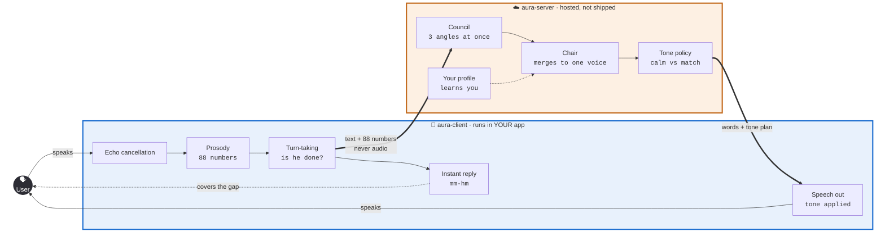

<div align="center">

# Aura

**A voice pipeline that listens to *how* you talk — not just what you say.**

*Most voice AI transcribes your words and throws the rest away.*
*Aura keeps the rest, and answers in a tone chosen to fit.*

</div>

---

> ### ⚠️ Pre-alpha
> Architecture and research are complete. **Implementation has not started.**
> The interfaces below describe the intended design, not working software.
> Star the repo if you'd like to know when it ships.

---

## The idea in thirty seconds

You're talking fast. Clipped sentences, no pauses, voice a little tight.

Every current assistant hears **the words**. Aura also hears **the tension** — and answers slower
and quieter than you're speaking, because matching your energy would make it worse.

That's the whole product. Everything else is engineering.

**It isn't a hunch.** In a study of over a million human ratings, only **4 of 15** speech-to-speech
systems performed *better* with audio than with a plain transcript. Most "voice-native" AI already
has the acoustics and simply ignores them.

---

## How it fits together



**Two halves, deliberately split.**

| | Runs where | Why there |
|---|---|---|
| **`aura-client`** | Inside your app | Some jobs can't wait. Echo cancellation needs the speaker signal *as it plays*, and the "mm-hm" that keeps a conversation alive must land in ~200 ms. A network round trip costs more than the entire budget. |
| **`aura-server`** | Hosted | The thinking. Allowed to be slow, because the client is covering. |

🔒 **Only text and 88 numbers cross the network. Your audio never leaves the device.**

---

## Install

**You install the client. The server is hosted for you** — there's nothing to run, provision, or
maintain on your side.

<table>
<tr><th>Platform</th><th>Install</th></tr>
<tr><td><b>Python</b></td><td><pre>pip install aura-client</pre></td></tr>
<tr><td><b>iOS / Swift</b></td><td><pre>.package(url: "https://github.com/fivestone14/Aura", from: "0.1.0")</pre></td></tr>
<tr><td><b>Android / Kotlin</b></td><td><pre>implementation("ai.aura:aura-client:0.1.0")</pre></td></tr>
<tr><td><b>Node / Web</b></td><td><pre>npm install @aura/client</pre></td></tr>
</table>

### Then three lines

```python
import aura

session = aura.connect(api_key="your-key")

@session.on_speech
def reply(turn):
    print(f"They said: {turn.text}")
    print(f"Speaking {turn.prosody.rate:+.0%} vs their normal")

    # You supply the words. Aura chooses the tone.
    session.say("I hear you — let's take that one piece at a time.")

session.start()
```

That's a working voice agent. You never touch echo cancellation, acoustic features, or turn
detection — they're already running.

<details>
<summary><b>The same thing in Swift, Kotlin, and C++</b></summary>

```swift
// Swift
let session = try Aura.connect(apiKey: "your-key")
session.onSpeech { turn in
    print("Rate: \(turn.prosody.rate)")
    session.say("I hear you.")
}
```

```kotlin
// Kotlin
val session = Aura.connect(apiKey = "your-key")
session.onSpeech { turn ->
    println("Rate: ${turn.prosody.rate}")
    session.say("I hear you.")
}
```

```cpp
// C++
auto session = aura::connect("your-key");
session.on_speech([&](const aura::Turn& t) {
    std::cout << "Rate: " << t.prosody.rate << "\n";
    session.say("I hear you.");
});
```

Every language calls the same compiled core through a small wrapper. One build per *platform*,
one thin wrapper per *language*.
</details>

---

## What you get from a turn

```python
turn.text                 # "I don't know, it's just been a lot lately"
turn.prosody.rate         # +0.31   → 31% faster than their baseline
turn.prosody.energy       # +0.18   → louder than usual
turn.prosody.pitch_range  # -0.22   → flatter, less melodic
turn.prosody.pauses       # 0       → no breaks
turn.prosody.features     # all 88 raw eGeMAPS values, if you want them
```

Every number is **relative to that person's own normal**, not a population average — so "fast" means
fast *for them*.

---

## Why it sounds different

<table>
<tr>
<td width="33%"><b>🎚️ It counter-regulates</b><br/><br/>Tense user gets a calm reply, not a matching one. Grounded in crisis de-escalation practice and infant-directed speech research — and tested against a dedicated set of cases where copying the user would be the wrong move.</td>
<td width="33%"><b>🔇 No voiceprints. Ever.</b><br/><br/>Identity is a device certificate, not your voice. A voiceprint is legally a biometric identifier; a device certificate is just a login. Same personalization, none of the exposure.</td>
<td width="33%"><b>📐 Measured, not guessed</b><br/><br/>88 standard acoustic features, computed directly. No emotion classifier — inferring emotion categories from audio is contested, and valence is close to unreadable from sound alone.</td>
</tr>
</table>

**And it learns you.** Tell it *"you ramble"* and it records that — in a plain readable document you
can inspect, export, or delete. Not a hidden score.

---

## Built on

[Pipecat](https://github.com/pipecat-ai/pipecat) `BSD-2` ·
[Smart Turn v3](https://huggingface.co/pipecat-ai/smart-turn-v3) `BSD-2` ·
[Kokoro-82M](https://huggingface.co/hexgrad/Kokoro-82M) `Apache-2.0` ·
[openSMILE](https://www.audeering.com/research/opensmile/) ·
[VAP](https://github.com/ErikEkstedt/VAP) `MIT`

---

## Roadmap

| | Phase | State |
|---|---|---|
| **0** | Echo cancellation · TTS controllability · security gate | 🔜 Next |
| **1** | End-to-end conversation, rules only | — |
| **2** | Real-time timing | — |
| **3** | Prosody perception | — |
| **4** | The council | — |
| **5** | The Interpreter — per-user adaptation | — |
| **6** | Appropriateness evaluation | — |
| **7** | Packaging — client libraries per platform | — |

<details>
<summary><b>Known open questions</b></summary>

- **Kokoro prosody predictors** — the release is decoder-only. Confirm duration/F0/energy are
  reachable and overwritable at inference before committing to it as the renderer.
- **Piper licence** — a *fallback* TTS, not currently a dependency. The active repo is GPL-3
  (copyleft), incompatible with this project's Apache-2.0. Must be resolved before it is ever added.
- **Apple Silicon ports** — Kokoro's MLX/CoreML ports are community-maintained and unverified.
- **Does the council earn its keep?** At equal compute, a single agent matches multi-agent setups on
  clean input. The council is justified by *robustness on noisy transcripts* — which is measurable,
  and will be measured in Phase 4. If the transcripts turn out cleaner than expected, it collapses
  to one agent, and that's a simplification rather than a failure.
</details>

---

## Privacy

Aura runs on hardware its operator owns. It stores **stated preferences** and **aggregate speaking
statistics** — never raw audio, never voice embeddings, never per-utterance emotion logs. Anyone not
enrolled on a device is never profiled at all.

## Licence

[Apache-2.0](LICENSE)
